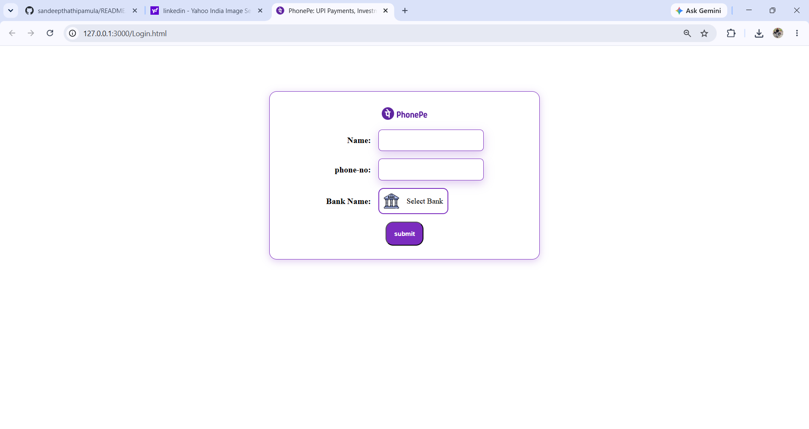
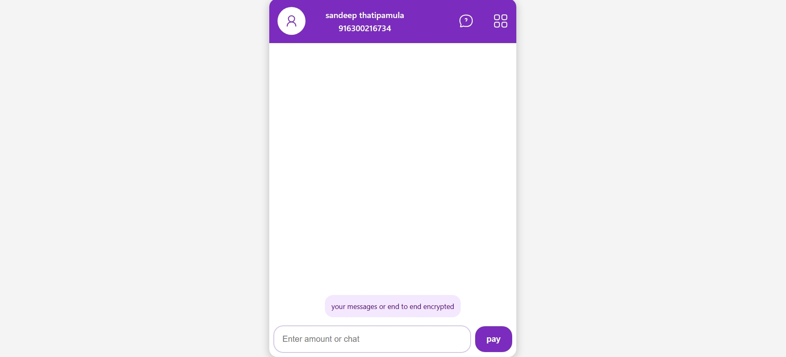

<!-- 

  

 -->
T.Sandeep

# Hi 👋, I'm Sandeep Thatipamula

  

  

 AIML Undergraduate | Full Stack Developer

🎓 B.Tech AIML (4th Year)

## 👨‍💻 About Me

🎓 B.Tech AIML Undergraduate (4th Year)

💻 Full Stack Developer specializing in modern web application development.

⚛️ Building applications using React, Next.js, Node.js, MongoDB, PostgreSQL, and FastAPI.

🔐 Experienced in developing security-focused projects, including secure payment verification systems and cloud security solutions.

🗄️ Skilled in designing backend systems, REST APIs, database architectures, and full-stack web applications.

🚀 Passionate about building scalable, secure, and real-world software solutions.

## 📊 GitHub Stats

## 🚀 Technical Skills

### Programming Languages

### Web Development

### Databases

### Tools & Platforms

## 🔥 Featured Projects

## Secure Payment Verification System

**Duration:** Dec 2025 – Jan 2026

Developed a web-based security system designed to enhance the safety of mobile payment transactions by introducing an additional verification layer for high-value payments.

### Key Features

* User-defined transaction limit for payment control
* Additional identity verification for transactions exceeding the predefined limit
* Automatic photo capture when an unauthorized payment attempt is detected
* Secure notification delivery through a temporary WhatsApp link
* Privacy-focused design with temporary access to captured images

### Privacy & Security

Captured images are not stored permanently. Access is provided only through a temporary secure link, and both the image and link automatically expire after a limited period to protect user privacy.

### 🛠️ Tech Stack

### Future Enhancements

* Face Recognition
* Fraud Detection System
* Mobile Application Integration
* Multi-Factor Authentication

## Project Architecture

User → Payment Request → Limit Check → Identity Verification → Payment Approval

Unauthorized Attempt → Photo Capture → Temporary Secure Link → WhatsApp Notification

## Secure Data Transfer and Verifiable Deletion in Cloud Computing

**Duration:** Academic Project

Developed a cloud security system focused on secure data migration and verifiable data deletion between cloud storage providers. The system ensures that transferred data remains intact during migration and allows users to verify that data has been permanently removed from the source cloud.

### Key Features

* Secure data transfer between cloud environments
* Data integrity verification during migration
* Publicly verifiable data deletion
* Detection of incomplete or malicious data transfers
* Counting Bloom Filter-based verification mechanism
* No Trusted Third Party (TTP) dependency

### Security Objectives

* Prevent unauthorized data retention
* Verify successful data migration
* Ensure transferred data integrity
* Enable transparent verification for cloud users
* Protect outsourced cloud data

## 📸 Project Screenshots

  
  

  
  

### 🛠️ Tech Stack

### System Architecture

Data Owner → Source Cloud → Secure Transfer Process → Target Cloud → Integrity Verification → Verifiable Deletion

### Future Enhancements

* Blockchain-based verification
* Multi-cloud migration support
* Real-time security monitoring
* Advanced encryption mechanisms

## 🚀 Upcoming Projects

### ⚡ Smart File Retrieval and Preloading System

A high-performance file retrieval architecture designed to minimize lookup latency through intelligent caching, preloading, and direct file mapping techniques.

**Core Concepts**

* ⚡ Predictive Data Preloading
* 💾 Redis-Based Caching
* 🗂️ Direct File ID Mapping
* 🔍 Fast Existence Verification
* 📊 Optimized Indexing Strategies

**Planned Tech Stack**

⚛️ React.js • 🟢 Node.js • 🚂 Express.js • 🍃 MongoDB • 🔴 Redis

**Goal**

Build a scalable retrieval system capable of serving frequently accessed content with minimal database overhead and near real-time response speeds.

<!-- 

  
  

 -->

⭐ Building practical software solutions and continuously improving development skills.
